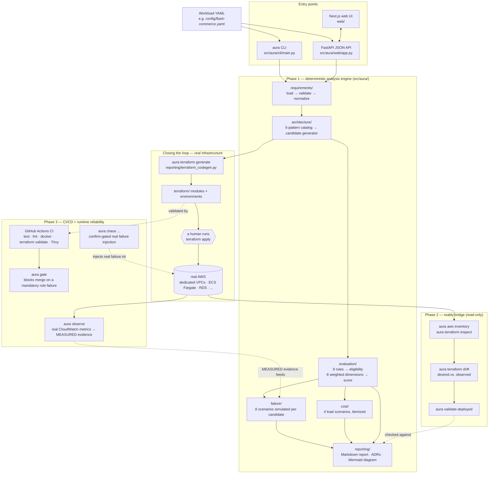

# AURA — Autonomous Unified Reliability Architecture

> **Design for success. Validate for failure.**

AURA is an architecture decision, validation, and reliability-analysis platform for AWS workloads. It converts business and non-functional requirements into explicit engineering constraints, evaluates multiple architecture patterns, models failure domains, estimates scalability and cost, and produces explainable architecture decisions and ADRs.

AURA is intentionally **not** an AWS service catalog or a generic Terraform wrapper. Its central problem is architectural judgment:

> Given a workload, its constraints, and its failure assumptions, **which architecture is the best trade-off and why?**

See [docs/PROJECT_VISION.md](docs/PROJECT_VISION.md) for the full motivation and [ADR-0001](adr/ADR-0001-project-scope.md)/[ADR-0002](adr/ADR-0002-rule-based-first.md)/[ADR-0003](adr/ADR-0003-read-only-aws-validation.md) for the scoping decisions that shaped it.

## Status

All three phases below are implemented, tested, and — unusually for a course project — actually running on real AWS, not just described:

- **148 automated tests** (unit, golden-file, property-based) passing — see [Testing](#testing).
- **CI is green** on real GitHub-hosted runners: tests, lint, architecture gate, both Docker images, Terraform validate, and a Trivy security scan all run on every push — see [`.github/workflows/ci.yml`](.github/workflows/ci.yml).
- **Two Terraform environments are live on real AWS**, each in dedicated (never default) VPCs: [`terraform/environments/flash-commerce`](terraform/environments/flash-commerce) — the demo workload, deployed as the actual multi-region architecture AURA recommended for it — and [`terraform/environments/aura-control-plane`](terraform/environments/aura-control-plane) — AURA's own API and web UI, each behind their own ALB.
- The web UI is a real, hosted, working application talking to a real deployed backend — not a static mockup. See [Web UI](#web-ui).

What's *not* done, honestly: nothing in the running system can trigger `terraform apply` itself (see [Non-goals](#non-goals)) — every deploy in this repo's history was run by a human from a terminal, on purpose. `aura chaos` (real, mutating AWS failure injection) is implemented and tested against mocks but has deliberately never been run for real.

## Project goals

1. Convert human requirements into machine-readable constraints.
2. Generate or select candidate AWS architecture patterns.
3. Evaluate candidates against availability, RTO/RPO, scalability, security, cost, operations, and complexity.
4. Model explicit failure scenarios and blast radius.
5. Produce explainable architecture decisions and ADRs.
6. Evolve from static architecture analysis into infrastructure validation and deployment gates.
7. Provide a foundation for Units 1–5 rather than five disconnected assignments.

## Non-goals

AURA is not intended to:

- autonomously deploy arbitrary production workloads without a human running `terraform apply` themselves;
- replace AWS documentation or professional architecture review;
- guarantee exact AWS bills or exact recovery times;
- make unsupported claims about service behavior without an evidence source (see the MODELLED/SIMULATED/MEASURED evidence policy in [docs/FAILURE_MODEL.md](docs/FAILURE_MODEL.md)).

## Three-phase implementation

### Phase 1 — Architecture Intelligence Lab ✅

The core architecture model, requirements parser, candidate architecture catalog, scoring engine, failure model, trade-off engine, and report/ADR generator — all deterministic, all local, no AWS calls. `aura validate` / `analyze` / `failures` / `score` / `report` / `adr`, plus the web UI's live demo.

Details: [docs/REQUIREMENTS_ENGINE.md](docs/REQUIREMENTS_ENGINE.md), [docs/SCORING_ENGINE.md](docs/SCORING_ENGINE.md), [docs/FAILURE_MODEL.md](docs/FAILURE_MODEL.md), [docs/COST_MODEL.md](docs/COST_MODEL.md).

### Phase 2 — Infrastructure Reality Bridge ✅

Reads real Terraform plan JSON and real (read-only) AWS inventory, compares desired vs. observed architecture, and — closing a gap this project's own review process caught — **generates** real, applyable Terraform directly from a candidate's computed topology, so a changed recommendation doesn't leave the infrastructure behind.

Details: [docs/AWS_INTEGRATION.md](docs/AWS_INTEGRATION.md), [`terraform/README.md`](terraform/README.md#generated-environments--closing-the-aura--terraform-loop).

### Phase 3 — Continuous Reliability Platform ✅

CI/CD gate, Dockerized services, ECS progressive delivery (deployment circuit breaker), CloudWatch observability, a Trivy security scan, and confirm-gated real chaos-injection commands.

Details: [docs/IMPLEMENTATION_PHASES.md](docs/IMPLEMENTATION_PHASES.md), [docs/DEMO_RUNBOOK.md](docs/DEMO_RUNBOOK.md).

## How it's all done

Two entry points (CLI, web UI) drive the same deterministic engine. A candidate's topology can additionally be turned into real Terraform and deployed by a human; once deployed, a second set of tools reads that real infrastructure back and compares it against what was intended.



Every evidence-bearing claim in a report is tagged **MODELLED** (computed from the topology graph, nothing real touched), **SIMULATED**, or **MEASURED** (real CloudWatch data via `aura observe` — the only command that produces this tier). See [docs/FAILURE_MODEL.md](docs/FAILURE_MODEL.md).

## Example input

```yaml
application:
  name: flash-commerce
  type: ecommerce

traffic:
  average_rps: 5000
  peak_rps: 150000
  peak_duration_minutes: 20

availability:
  target: 99.99%

recovery:
  rto_minutes: 5
  rpo_minutes: 1

consistency:
  orders: strong
  catalog: eventual

geography:
  primary_regions:
    - ap-south-1
  user_regions:
    - IN
    - SG
    - AE

budget:
  monthly_usd: 15000

deployment:
  frequency_per_day: 10
  downtime_allowed: false

security:
  internet_facing: true
  data_classification: confidential
```

The full workload (including consistency-per-entity, compliance frameworks, and stated assumptions) is [config/flash-commerce.yaml](config/flash-commerce.yaml) — see [docs/DEMO_RUNBOOK.md](docs/DEMO_RUNBOOK.md) for a walkthrough of exactly why this input was chosen as the case study.

## Example output

```text
AURA ARCHITECTURE REPORT
========================
Recommendation: Multi-AZ primary + warm regional recovery

Reliability       94/100
Scalability       91/100
Security          96/100
Operations        89/100
Cost               81/100
Complexity         76/100
Overall            90/100

RTO target         5 min
Expected envelope  3–5 min
RPO target         1 min
Expected envelope  <1 min

Top risk:
Regional recovery depends on database promotion and traffic cutover.

Rejected alternative:
Multi-region active-active. Higher cost and data consistency complexity
without sufficient business benefit for the supplied constraints.
```

(Illustrative — run `aura report config/flash-commerce.yaml` for the real, current output, which also includes the full rule table, all 8 failure scenarios, and itemized cost line items.)

## Stack

### Core

- Python 3.12+, [FastAPI](src/aura/web/app.py), [Pydantic](src/aura/domain/models.py) v2, [Typer](src/aura/cli/main.py), PyYAML, Jinja2 ([report](src/aura/reporting/markdown.py)/[ADR](src/aura/reporting/adr.py)/[Terraform](src/aura/reporting/terraform_codegen.py) templates), pytest, ruff.
- [Next.js 16](web/) (App Router, Turbopack), React 19, TypeScript, Tailwind v4.

### AWS / infrastructure

- boto3 (read-only inventory + confirm-gated chaos injection), Terraform (AWS provider), Docker.
- Amazon ECS Fargate, ALB, RDS Multi-AZ + cross-region read replicas, ElastiCache, SQS, CloudWatch, ECR, Secrets Manager, KMS.
- GitHub Actions (test/lint/gate/docker/terraform-validate/Trivy on every push; an opt-in real-AWS plan job once an `AWS_ROLE_ARN` secret exists).

## Repository structure

```text
.
├── README.md                    — this file
├── AGENTS.md                    — instructions for AI coding agents working in this repo
├── IMPLEMENTATION.md            — the original iteration-by-iteration build checklist
├── CONTRIBUTING.md · SECURITY.md · LICENSE
│
├── docs/                        — design docs, one per engine/concern
│   ├── PROJECT_VISION.md
│   ├── IMPLEMENTATION_PHASES.md
│   ├── ARCHITECTURE.md
│   ├── REQUIREMENTS_ENGINE.md
│   ├── SCORING_ENGINE.md
│   ├── FAILURE_MODEL.md
│   ├── COST_MODEL.md
│   ├── AWS_INTEGRATION.md
│   ├── TESTING.md
│   ├── DEMO_RUNBOOK.md
│   └── ROADMAP.md
│
├── agents/                      — conceptual spec for each pipeline stage, 1:1 with src/aura/
│   ├── AGENT_ORCHESTRATOR.md
│   ├── AGENT_REQUIREMENTS.md
│   ├── AGENT_ARCHITECTURE.md
│   ├── AGENT_FAILURE.md
│   ├── AGENT_COST.md
│   ├── AGENT_AWS_VALIDATOR.md
│   └── AGENT_REPORTER.md
│
├── architecture/                — this repo's own design, not the workloads it analyzes
│   ├── logical.md
│   ├── runtime.md
│   └── decision-framework.md
│
├── adr/                         — Architecture Decision Records for AURA itself
│   ├── ADR-0001-project-scope.md
│   ├── ADR-0002-rule-based-first.md
│   └── ADR-0003-read-only-aws-validation.md
│
├── config/flash-commerce.yaml   — the case-study workload
├── schemas/                     — JSON Schemas for workload/architecture documents
├── scripts/                     — bootstrap/validate/schema-gen helper scripts
│
├── tests/
│   ├── unit/                    — 140 tests, one file per engine module
│   ├── golden/                  — flash-commerce's decision, pinned and stable
│   └── integration/
│
├── terraform/                   — see terraform/README.md
│   ├── modules/                 — networking · compute · database · cache · queue
│   └── environments/
│       ├── flash-commerce/      — the case-study workload, deployed for real
│       └── aura-control-plane/  — AURA's own API + web UI, deployed for real
│
├── .github/workflows/           — ci.yml, runtime-validation.yml
├── Dockerfile · Dockerfile.web · docker-compose.yml
│
├── web/                         — Next.js UI over the FastAPI JSON API (see web/README.md)
│   └── src/
│
└── src/aura/
    ├── domain/                  — enums, Workload/graph models, parsing
    ├── requirements/            — loader, validator, normalizer
    ├── architecture/            — pattern catalog, candidate generator
    ├── failure/                 — scenarios, simulator, blast radius
    ├── cost/                    — scenario-based cost estimates
    ├── evaluation/               — rules, scoring, eligibility
    ├── providers/                — Terraform plan parser, AWS inventory, chaos, observability
    ├── reporting/                — Markdown report, ADR, diagram, Terraform codegen
    ├── web/                      — FastAPI app backing the Next.js UI
    └── cli/                      — the aura command
```

## Quick start

```bash
python -m venv .venv
source .venv/bin/activate
pip install -e ".[dev,aws]"   # [aws] (boto3) is needed to run the full test suite —
                               # the Phase 2 provider tests mock the AWS calls but still
                               # import boto3 itself

aws sts get-caller-identity
terraform version

aura validate config/flash-commerce.yaml
aura analyze config/flash-commerce.yaml
aura failures config/flash-commerce.yaml
aura score config/flash-commerce.yaml
aura report config/flash-commerce.yaml --output artifacts/report
aura adr config/flash-commerce.yaml --output artifacts/adr

pytest -q
```

## CLI reference

Every command's implementation lives in [`src/aura/cli/main.py`](src/aura/cli/main.py).

| Command | What it does |
| --- | --- |
| `aura validate <workload.yaml>` | Schema-validate a workload document. |
| `aura analyze <workload.yaml>` | Run the full pipeline; print every candidate and its score. |
| `aura failures <workload.yaml>` | Failure simulation only. |
| `aura score <workload.yaml>` | Scoring only. |
| `aura report <workload.yaml> --output <dir>` | Full Markdown report. |
| `aura adr <workload.yaml> --output <dir>` | Generated ADRs only. |
| `aura terraform generate <workload.yaml> -o <dir>` | Real, applyable Terraform rendered from a candidate's actual topology. |
| `aura aws inventory` | Real, read-only AWS resource listing. |
| `aura terraform inspect <plan.json>` | Parse a real `terraform show -json` plan. |
| `aura terraform drift <plan.json>` | Compare a Terraform plan against live AWS. |
| `aura validate-deployed --workload <yaml> --region <r>` | Combined AWS inventory + Terraform + failure-model conformance check. |
| `aura gate <workload.yaml> --min-confidence <n>` | CI gate: fail the build on a mandatory rule failure or low confidence. |
| `aura observe --region <r>` | Real CloudWatch metrics — the one command producing MEASURED evidence. |
| `aura chaos terminate-task` / `remove-target` | Confirm-gated real, mutating failure injection. |
| `aura chaos synthetic-traffic` | Safe synthetic load generation, no AWS credentials needed. |
| `aura serve` | Runs the FastAPI backend the web UI talks to. |

## Web UI

A Next.js front end ([`web/`](web/), see [web/README.md](web/README.md)) runs the same pipeline in the browser — a "how it works" walkthrough plus a live demo you can point at any workload YAML. It talks to a small FastAPI JSON API (`aura serve`); the analysis itself never calls AWS.

```bash
# terminal 1 — API
pip install -e .
aura serve                 # http://127.0.0.1:8000

# terminal 2 — UI
cd web
npm install
npm run dev                # http://localhost:3000
```

Then open http://localhost:3000. The browser only ever calls the UI's own origin (`/api/*`); a Next.js Route Handler ([`web/src/app/api/[...path]/route.ts`](web/src/app/api/%5B...path%5D/route.ts)) forwards those server-side to the real API, read from `AURA_API_URL` at request time — so if the API runs on a non-default host/port, point the UI at it with that var:

```bash
aura serve --port 8100
AURA_API_URL=http://127.0.0.1:8100 npm run dev -- --port 3100
```

This also means the browser and the API are never in a cross-origin relationship in normal use, so `AURA_WEB_ORIGIN` CORS allow-listing on the API is only relevant if something else (a script, `/docs`) calls the API directly from a browser.

For an always-on deployment instead of localhost, see [`terraform/environments/aura-control-plane/`](terraform/environments/aura-control-plane) — it stands up both services behind their own ALBs and wires `AURA_API_URL` between them automatically.

## Infrastructure

Full details, commands, and cost notes: [terraform/README.md](terraform/README.md).

- [`terraform/modules/`](terraform/modules) — five reusable modules (networking, compute, database, cache, queue), each purpose-built with an explicit CIDR VPC, never the account's default VPC.
- [`terraform/environments/flash-commerce/`](terraform/environments/flash-commerce) — the case-study workload's real multi-region-warm-standby infrastructure.
- [`terraform/environments/aura-control-plane/`](terraform/environments/aura-control-plane) — AURA's own API and web UI, hosted for real.
- `aura terraform generate` — the same modules, but rendered directly from any workload's computed candidate rather than hand-written once.

## Testing

148 tests across three kinds — see [docs/TESTING.md](docs/TESTING.md) for the rationale behind each:

- **Unit tests** ([`tests/unit/`](tests/unit)) — one file per engine module, including mocked-AWS provider tests (`test_aws_provider.py`, `test_chaos_provider.py`, ...) and `test_terraform_codegen.py` for the generator.
- **Golden-file test** ([`tests/golden/`](tests/golden)) — pins flash-commerce's actual computed decision (recommendation, eligibility, ranking) so a rule/scoring change that silently flips it fails loudly.
- **Property-based tests** (`tests/unit/test_properties.py`) — invariants like "raising the required availability target can never make a rule's status get better," checked across inputs rather than one fixed example.

```bash
pytest -q                              # 148 tests
ruff check src tests && ruff format --check src tests
cd web && npm run lint && npm run build
```

## CI/CD

[`.github/workflows/ci.yml`](.github/workflows/ci.yml) runs on every push: Python tests + lint, the `aura gate` architecture gate against the case-study workload, the web UI's lint+build, both Docker images, and Terraform fmt/validate + a Trivy security scan — all with zero AWS credentials. A `terraform-plan` job stays inert (skipped, not failing) until an `AWS_ROLE_ARN` repository secret is added, so CI never depends on real credentials existing by default. [`.github/workflows/runtime-validation.yml`](.github/workflows/runtime-validation.yml) would periodically re-run `aura validate-deployed` the same way, once that secret exists.

## Engineering principles

### 1. Requirements before services

Never start with "use ECS." Start with the availability, capacity, data, security, and recovery constraints.

### 2. Explainability before cleverness

Every recommendation must have a reason, evidence, assumptions, and a confidence level.

### 3. Rule-based core before AI-generated decisions

The first decision engine is deterministic and testable ([ADR-0002](adr/ADR-0002-rule-based-first.md)). LLM or agent assistance can be added later for requirement extraction and narrative generation, but the final score and policy evaluation must remain auditable.

### 4. Read-only AWS integration first

AURA should inspect AWS before it is trusted to mutate AWS ([ADR-0003](adr/ADR-0003-read-only-aws-validation.md)).

### 5. Failure is a first-class input

A design that only describes the healthy path is incomplete.

### 6. Cost is a constraint, not a report footnote

A technically excellent design that violates the business budget is not automatically the right design.

## Course milestones

| Unit | Scope | Status |
| --- | --- | --- |
| 1 | Architecture intelligence — requirements → candidates → scoring → failure analysis → ADRs | ✅ done |
| 2 | The chosen architecture becomes real Terraform-managed infrastructure | ✅ done — two live environments, plus `aura terraform generate` for any workload |
| 3 | AURA inside CI/CD as an architecture gate | ✅ done — `aura gate` blocks the build on a mandatory rule failure |
| 4 | Containerized service topology and scaling validated | ✅ done — ECS Fargate, deployment circuit breaker, real health checks |
| 5 | Observability, security, drift, runtime reliability, controlled chaos | ✅ implemented (`observe`, `validate-deployed`, Trivy, `chaos ...`) — chaos commands deliberately never executed for real |

Unit 1's own definition of done: a reviewer can provide a workload YAML, run one AURA command, receive at least three candidate architectures, see why one was selected, inspect the failure scenarios/blast radius and scoring breakdown, inspect the generated ADRs, understand which assumptions are uncertain, and reproduce the same result locally. All of that is true today — `aura analyze config/flash-commerce.yaml` or the web UI's "Try it" section both demonstrate it end to end.
